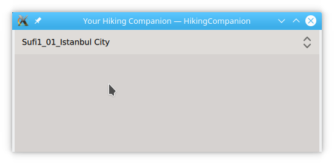
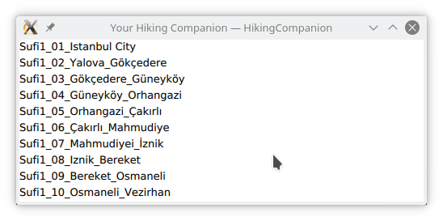

[TOC]

# Designing the application
## Diagrams showing the relations of the classes

Examples of certain classes are shown here: 1) Class inheriting from QObject 2) based on templates are drawn like
```plantuml
class someClass1 << (O,yellow) >>
class someClass2 << (T,lightblue) >>
class someClass3 << (q,#ffee88) >>
```

### Basic structure
The `ConfigData` is a singleton class which is used to keep all data alive and therefore it is not necessary to initialize all data again and again upon instantiation of an object. The `Config` class will become a hook to get to the data from QML.

```plantuml
class "Singleton<ConfigData>" as ConfigData << (S,#FF7700) >>
class Config << (O,yellow) >>
class GpxFiles << (O,yellow) >>
class GpxFile << (O,yellow) >>

class "ApplicationPage" as ap << (q,#ffee88) >>
class "MapPage" as mp << (q,#ffee88) >>
class "TracksPage" as tp << (q,#ffee88) >>
class "ConfigPage" as cp << (q,#ffee88) >>

class call_once << (T,lightblue) >>
class Singleton << (T,lightblue) >>


Config *- ConfigData
'ConfigData *- GpxFiles
GpxFiles *- GpxFile

call_once -- Singleton
Singleton -- ConfigData

ap --> mp
ap -> cp
ap --> tp

cp -> Config
tp -> GpxFiles
tp --> mp
```

# Path settings

# Deployment test on linux
We must try to setup an environment where we can simulate the sharing of data between applications. The main goal is to get a clear view where to place the data and which locations can be used to copy the data to. The tracking app  can also search for the HikingCompanion specific data to see if that program is installed and available for use.

Data is always shared between the same user. On mobile devices there is only one user which is installing applications etc.

Using the information from [this document here][std paths] and [here][android data], the following path can be of use;


* **QStandardPaths::AppDataLocation**. This field returns a list of directories where an application can keep its data.
  * **Linux**: `~/.local/share`, `/usr/share/kde-settings/kde-profile/default/share`, `/usr/local/share`, `/usr/share`

  * **Android**: Below, `<APPNAME>` is usually the organization name. Similarly, `<APPROOT>` is the location where this application is installed and `<APPDIR>` is the directory containing the application executable.
    On Android this is `<APPROOT>/files` and `<USER>/<APPNAME>/files`.
    On my tablet, where applications are stored at `/data/user/0/` and the application id or `<APPNAME>` is `io.martimm.github.HikingCompanion`, the paths are  `/data/user/0/io.martimm.github.HikingCompanion/files`, `/storage/emulated/0/Android/data/io.martimm.github.HikingCompanion/files`. The first one is private and not reachable by other apprlications but the second can be read or written by all apps.
    To write to the external storage on Android, the android app needs the `WRITE_EXTERNAL_STORAGE` permission.

  * **Ios**:
    `<APPROOT>/Library/Application Support`. There are no examples yet to show.

* **QStandardPaths::GenericDataLocation**. Returns a directory location where persistent data shared across applications can be stored. This is a generic value. The returned path is never empty.

  This might be a better choice because it is one level lower and always writable for any app.

  * **Linux**: `~/.local/share`, `/usr/local/share`, `/usr/share`

  * **Android**: `<USER>` which will become `/storage/emulated/0/Android/data/`.

  * **Ios**: `<APPROOT>/Documents`

# Configuration of settings
Settings are used to store data between runs. There are several categories to be set. E.g. program settings like a language selection is placed in a **[General]** section. The location of this file depends on the system where it is running. For linux it will be `$HOME/.config/martimm/HikingCompanion.conf` and on android `/data/user/0/io.martimm.github.HickingCompanion/files/config/HikingCompanion.conf`.

```
[General]
defaultlang=en                Fallback language when no translation is
                              available. This means that all words must be at
                              least be described in that language.
supportedlang=en,nl           Language codes. Needs to be thought over.
translationfile=              Translation file
languageindex=1               Index in pull-down of languages

selectedhikeindex=0           Index in pull-down from HikeList. Language
                              information is set after selecting a hike. When no
                              hike is available it sets the default to english.

[User]                        User data
consent=false             
email=
username=

[HikeList]                    List of hikes. The hike list can contain one or
                              more tracks. The current user may save their own
                              tracks and will be added to this list. All hikes
                              are coded with h#.
h0=sometrail
h1=...


[h0.sometrail]                Specific information about this hike.
version=
title=                        Title of hike. Make it as unique as possible. The
                              text is used in the pull-down list.
shortdescr=                   Short description
www=                          There might even be a website around the hike.

defaultlang=en                Language information for this hike
supportedlang=en
translationfile=

gpxfileindex=                 Index in a pull-down of tracks about this hike.
ntracks=                      number of tracks, notes, photos and features
nnotes=
nphotos=
nfeatures=

[h0.sometrail.track1]         Information about the first track
fname=                        Gpx file with all coordinates
type=                         bike or walk
title=                        Title of track
shortdescr=                   Short description

length=                       Length in kilometers. Calculated when selected.
minlon=                       Boundaries of track. Calculated when selected.
minlat=
maxlon=
maxlat=

[h0.sometrail.track2]         Second track
...

[h0.sometrail.Releases]       Release notes
0.0.1="Setup hike config"
...

[h1. ...]                     Second hike

...
```

When data is imported, a path to the directory is provided where a settings file is stored. This file is named `hike.conf`.

```
[General]
version=                      Version of this track

supportedLang=en
defaultLang=en
translationXML=

hike=                         Name used in the HikeList and table names
title=
shortdescr=
www=

tracksdir=                    Sub-directories where data is stored.
photodir=
notedir=
featuredir=

[track1]                      First track
fname=                        Filename of track
title=
shortdescr=
type=

[track2]                      Second track
...

[Releases]                    Release notes about this hike
0.0.1="Setup hike config"
...

```

# Code snippets
Working with qtcreator based on qt 5.11.1, build on July 17th 2018

## Using QVariantList to populate a QML ComboBox

Snippets to show how to populate a `QML` `ComboBox` from data held in c++. See also [here][cppcombobox] and [here][cppmodels]. In the end the result looks like:


### C++ gpxfiles.h
```
#ifndef GPXFILES_H
#define GPXFILES_H

#include <QObject>
#include <QVariantList>

class GpxFiles : public QObject {

  Q_OBJECT
  Q_PROPERTY( bool readGpxFileInfo READ readGpxFileInfo)

public:
  explicit GpxFiles(QObject *parent = nullptr);
  ~GpxFiles();

  Q_INVOKABLE QVariantList gpxTrackList();

signals:
  void gpxFileListChanged();

public slots:

private:
  void _setGpxFiles();

  QVariantList _gpxTrackList;
};

#endif // GPXFILES_H
```

### C++ gpxfiles.cpp
```
#include "gpxfiles.h"

GpxFiles::GpxFiles( QObject *parent) : QObject(parent) {}

GpxFiles::~GpxFiles() {
  _gpxTrackList.clear();
}

QVariantList GpxFiles::gpxTrackList() {
  return _gpxTrackList;
}

bool GpxFiles::readGpxFileInfo() {
  _setGpxFiles();
  emit gpxFileListChanged();
  return true;
}

void GpxFiles::_setGpxFiles() {

  _gpxTrackList.clear();
  _gpxTrackList.append("Sufi1_01_Istanbul City");
  _gpxTrackList.append("Sufi1_02_Yalova_Gökçedere");
  _gpxTrackList.append("Sufi1_03_Gökçedere_Güneyköy");
  ...
}
```
### The main.cpp file
```
#include "gpxfiles.h"

#include <QGuiApplication>
#include <QQmlApplicationEngine>

// ----------------------------------------------------------------------------
int main( int argc, char *argv[]) {

  QGuiApplication app( argc, argv);

  qmlRegisterType<GpxFiles>(
        "io.github.martimm.HikingCompanion.GpxFiles", 0, 1, "GpxFiles"
        );

  QQmlApplicationEngine engine;
  engine.load(QUrl(QStringLiteral("qrc:/test.qml")));

  if ( engine.rootObjects().isEmpty() ) return -1;
  return app.exec();
}
```

### QML file test.qml
```
import io.github.martimm.HikingCompanion.GpxFiles 0.1

import QtQuick 2.9
import QtQuick.Controls 2.2
import QtQuick.Window 2.3

ApplicationWindow {
  id: root
  visible: true
  width: 500
  height: 200

  Component.onCompleted: {
    // read the data after which the object will emit signal gpxFileListChanged
    gpxf.readGpxFileInfo;
  }

  GpxFiles {
    id: gpxf

    onGpxFileListChanged: {
      cb.model = gpxf.gpxTrackList();
    }
  }

  ComboBox {
    id: cb
    width: parent.width
  }
}
```

## Using QVariantList or QStringList to populate a QML ListView

The following QML file can be used to use a `ListView`. Key here is the use of `delegate` and the `modelData` role which is generated by QT. The result now looks like:
.

The type `QVariantList` can also be replaced by `QStringList`.

```
import io.github.martimm.HikingCompanion.GpxFiles 0.1

import QtQuick 2.9
import QtQuick.Controls 2.2
import QtQuick.Window 2.3


ApplicationWindow {
  id: root
  visible: true
  width: 500
  height: 200

  Component.onCompleted: {
    gpxf.readGpxFileInfo;
  }

  GpxFiles {
    id: gpxf

    onGpxFileListChanged: {
      lv.model = gpxf.gpxTrackList();
    }
  }

  ListView {
    id: lv
    width: parent.width
    height: parent.height
    delegate: Rectangle {
      width: parent.width
      height: 20
      Text { text: modelData }
    }
  }
}
```

<!-- References ------------------------------------------------------------ -->
<!-- Hè hè, finally someone with a working suggestion: -->
[cppcombobox]: https://forum.qt.io/topic/43226/solved-qml-combobox-model-from-c/2
[cppmodels]: http://doc.qt.io/qt-5/qtquick-modelviewsdata-cppmodels.html
[b qt state]: http://blog.qt.io/blog/2009/01/30/qt-state-machine-framework/
[std paths]: http://doc.qt.io/qt-5/qstandardpaths.html
[android data]: https://developer.android.com/training/data-storage/files
